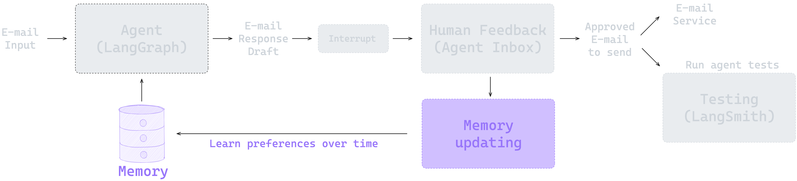
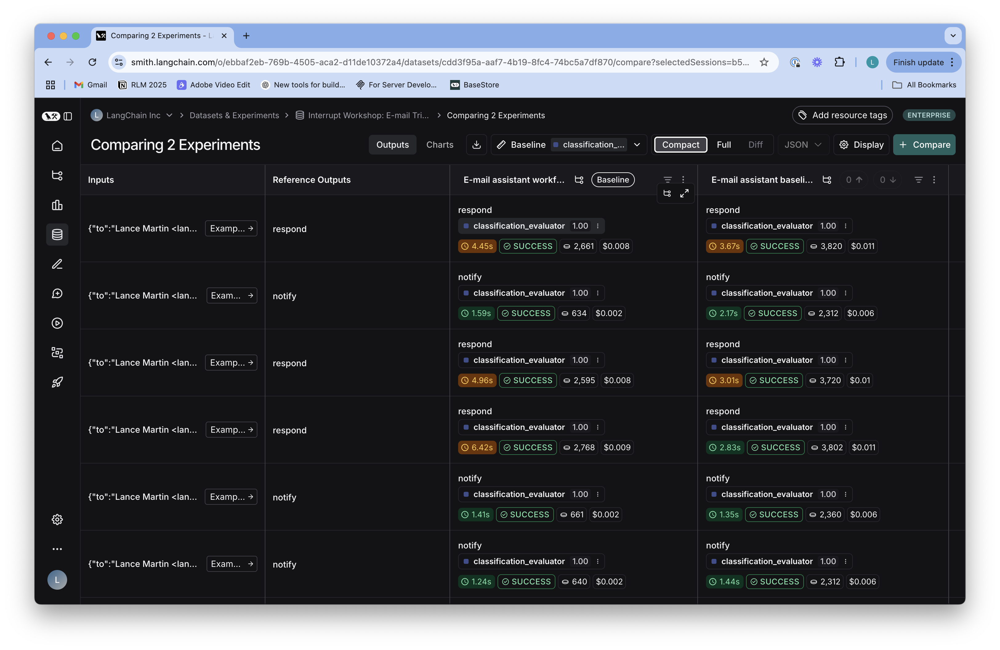

# Ambient Agent 101

A LangGraph-based email assistant demonstrating AI agent development from fundamentals to production deployment. This project teaches agent architecture, human-in-the-loop patterns, memory management, and Gmail API integration.

## Overview

This repository contains a progressive learning path for building ambient AI agents that can autonomously manage email workflows. The project implements an intelligent email assistant with four evolutionary stages:

1. **Basic ReAct Agent** - Email triage and automated responses
2. **Human-in-the-Loop** - Interactive agent with approval workflows  
3. **Memory Management** - Persistent user preferences and context
4. **Production Deployment** - Gmail integration with scheduled execution

## Project Structure

```
ambient_agent_101-m/
├── src/email_assistant/          # Core agent implementations
│   ├── email_assistant.py        # Stage 1: Basic ReAct agent
│   ├── email_assistant_hitl.py   # Stage 2: Human-in-the-loop
│   ├── email_assistant_hitl_memory.py       # Stage 3: Memory integration
│   ├── email_assistant_hitl_memory_gmail.py # Stage 4: Gmail production
│   ├── cron.py                   # Scheduled agent execution
│   ├── configuration.py          # Agent configuration schema
│   ├── schemas.py                # Pydantic models and state definitions
│   ├── prompts.py                # System prompts and templates
│   ├── utils.py                  # LLM initialization and utilities
│   ├── db.py                     # SQLite memory persistence
│   └── tools/                    # Agent tools and actions
│       ├── base.py               # Tool base classes
│       ├── default/              # Mock tools for development
│       │   ├── email_tools.py    # Email operations (mock)
│       │   ├── calendar_tools.py # Calendar operations (mock)
│       │   └── prompt_templates.py
│       └── gmail/                # Gmail API integration
│           ├── gmail_tools.py    # Real Gmail operations
│           ├── setup_gmail.py    # OAuth setup wizard
│           ├── setup_cron.py     # Cron job configuration
│           └── run_ingest.py     # Email ingestion pipeline
│
├── notebooks/                    # Interactive tutorials
│   ├── ambient_agent.ipynb       # Main learning notebook
│   └── evaluation.ipynb          # Agent evaluation
│
├── eval/                         # Evaluation framework
│   ├── email_dataset.py          # Test email datasets
│   ├── evaluate_triage.py        # Triage accuracy metrics
│   └── prompts.py                # Evaluation prompts
│
├── tests/                        # Test suite
│   ├── hitl_testing.ipynb        # HITL workflow tests
│   ├── memory_testing.ipynb      # Memory persistence tests
│   ├── test_notebooks.py         # Notebook execution tests
│   └── test_response.py          # Response quality tests
│
├── pyproject.toml                # Python dependencies
├── langgraph.json                # LangGraph deployment config
└── README.md                     # This file
```

## Features

### Email Triage System
- **Intelligent Classification**: Automatically categorizes emails as `ignore`, `notify`, or `respond`
- **Context-Aware Routing**: Uses LLM reasoning to understand email intent and urgency
- **Customizable Rules**: Adapts to user-defined preferences and priorities

### Agent Capabilities
- **ReAct Architecture**: Reasoning and action loop for complex email handling
- **Tool Integration**: Calendar management, email composition, information retrieval
- **Structured Output**: Type-safe responses using Pydantic models
- **Multi-Model Support**: Google Gemini (primary), OpenAI, Anthropic, and AWS Bedrock

### Memory Management
- **SQLite Persistence**: Long-term storage of user preferences and patterns
- **Context Retrieval**: Learns from past interactions to improve responses
- **Preference Learning**: Adapts writing style and decision-making over time

### Gmail Integration
- **OAuth2 Authentication**: Secure Gmail API access
- **Real-time Monitoring**: Automated email checking on schedule
- **Thread Management**: Maintains conversation context
- **Safe Operations**: Read-only by default with explicit write permissions

## Installation

### Prerequisites

- Python 3.11 or higher
- Google Gemini API key (primary LLM provider)
- LangSmith account for tracing ([sign up here](https://smith.langchain.com/))
- Gmail account (optional, for production use)
- Google Cloud credentials.json file (for Gmail API access)

### Quick Start

1. **Clone the repository**
```bash
git clone <repository-url>
cd ambient_agent_101-m
```

2. **Create environment file**
```bash
# Copy and edit .env file with your API keys
cp .env.example .env
```

Required environment variables:
```env
# Gemini API Configuration (Primary)
GEMINI_API_KEY=Your_API_Key
LLM_MODEL=gemini-2.5-flash-lite
GOOGLE_APPLICATION_CREDENTIALS=credentials.json

# LangSmith Tracing
LANGSMITH_API_KEY=Your_API_Key
LANGSMITH_TRACING=true
LANGSMITH_ENDPOINT=https://api.smith.langchain.com
LANGSMITH_PROJECT=Your_Project_Name

# Optional: Alternative LLM Providers
# ANTHROPIC_API_KEY=
# AZURE_OPENAI_API_KEY=
# AZURE_OPENAI_ENDPOINT=
# AWS_ACCESS_KEY_ID=
# AWS_SECRET_ACCESS_KEY=
# AWS_REGION=
```

3. **Install with uv (recommended)**
```bash
pip install uv
uv sync --extra dev
source .venv/bin/activate  # On Windows: .venv\Scripts\activate
```

**Or install with pip**
```bash
python -m venv .venv
source .venv/bin/activate  # On Windows: .venv\Scripts\activate
pip install --upgrade pip
pip install -e .
```

> **⚠️ Important**: The editable install (`-e .`) is required for notebooks to work correctly. The package is installed as `interrupt_workshop` but imported as `email_assistant`.

## Usage

### Development with Mock Tools

Start with the Jupyter notebook for interactive learning:

```bash
jupyter notebook notebooks/ambient_agent.ipynb
```

### LangGraph Studio

Deploy and test agents visually:

```bash
langgraph dev
```

Available graphs:
- `email_assistant` - Basic ReAct agent
- `email_assistant_hitl` - Human-in-the-loop version
- `email_assistant_hitl_memory` - With memory persistence
- `email_assistant_hitl_memory_gmail` - Full Gmail integration
- `cron` - Scheduled execution

### Gmail Production Setup

1. **Obtain Google Cloud credentials**
   - Create a project in Google Cloud Console
   - Enable Gmail API for your project
   - Create OAuth 2.0 credentials (Desktop app)
   - Download the credentials file and save it as `credentials.json` in the project root
   - Set the path in your `.env` file: `GOOGLE_APPLICATION_CREDENTIALS=credentials.json`

2. **Configure Gmail OAuth**
```bash
python src/email_assistant/tools/gmail/setup_gmail.py
```

3. **Set up scheduled monitoring**
```bash
python src/email_assistant/tools/gmail/setup_cron.py
```

4. **Test email ingestion**
```bash
python src/email_assistant/tools/gmail/run_ingest.py
```

## Agent Architecture

### State Machine

Each agent uses LangGraph's stateful workflow:

```python
State = {
    "messages": List[Message],        # Conversation history
    "email_input": Dict,              # Current email being processed
    "classification_decision": str     # Triage result
}
```

### Processing Flow

1. **Triage Router** - Classifies incoming email
2. **Response Agent** - Generates appropriate response (if needed)
3. **Tool Execution** - Performs actions (send email, check calendar)
4. **Human Approval** - Optional review step (HITL versions)
5. **Memory Update** - Learns from interactions

### Tools

**Default Tools (Mock)**:
- `write_email()` - Draft and send emails
- `triage_email()` - Classify email urgency
- `Done()` - Signal task completion
- `Question()` - Request user input

**Gmail Tools (Production)**:
- `list_unread_emails()` - Fetch inbox
- `send_gmail()` - Send via Gmail API
- `search_emails()` - Query email history
- `get_thread()` - Retrieve conversation context

**Calendar Tools**:
- `check_availability()` - Find free time slots
- `schedule_meeting()` - Create calendar events

## Evaluation

Run the evaluation suite to measure agent performance:

```bash
# Test triage accuracy
python eval/evaluate_triage.py

# Or use the evaluation notebook
jupyter notebook notebooks/evaluation.ipynb
```

Evaluation metrics:
- Classification accuracy (ignore/notify/respond)
- Response quality scoring
- Tool usage efficiency
- Human approval rates

## Testing

```bash
# Run all tests
python tests/run_all_tests.py

# Run specific test modules
pytest tests/test_response.py
pytest tests/test_notebooks.py -n auto
```

## Alternative LLM Models

The project uses Google Gemini as the primary LLM provider. To use alternative providers, edit `src/email_assistant/utils.py`:

**Google Gemini (Default)**:
```python
from langchain_google_genai import ChatGoogleGenerativeAI
llm = ChatGoogleGenerativeAI(model="gemini-2.5-flash-lite")
```

**OpenAI GPT**:
```python
from langchain_openai import ChatOpenAI
llm = ChatOpenAI(model="gpt-4")
```

**Anthropic Claude**:
```python
from langchain_anthropic import ChatAnthropic
llm = ChatAnthropic(model="claude-3-5-sonnet-20241022")
```

**AWS Bedrock**:
```python
from langchain_aws import ChatBedrock
llm = ChatBedrock(model_id="anthropic.claude-3-5-sonnet-20241022-v2:0")
```

**Azure OpenAI**:
```python
from langchain_openai import AzureChatOpenAI
llm = AzureChatOpenAI(azure_deployment="your-deployment")
```

Set corresponding API keys in `.env` file.

## Database

User preferences and memory are stored in SQLite:
- **Location**: `.db/memory.db`
- **Schema**: Key-value store with namespaces
- **Auto-initialization**: Created on first import

## Configuration

Customize agent behavior in `src/email_assistant/prompts.py`:
- `default_background` - User context and role
- `default_triage_instructions` - Classification rules
- `default_response_preferences` - Writing style
- `default_cal_preferences` - Scheduling preferences

## Contributing

This is an educational project. Modifications and experiments are encouraged! Key areas for extension:
- Additional tool integrations (Slack, Calendar APIs)
- Multi-agent orchestration
- Advanced memory retrieval (vector search)
- Custom evaluation metrics

## License

See LICENSE file for details.

## Resources

- [LangGraph Documentation](https://langchain-ai.github.io/langgraph/)
- [LangChain Academy](https://academy.langchain.com/)
- [Ambient Agents Concept](https://blog.langchain.dev/introducing-ambient-agents/)
- [Gmail API Documentation](https://developers.google.com/gmail/api)


This section shows how to add human-in-the-loop (HITL), allowing the user to review specific tool calls (e.g., send email, schedule meeting). For this, we use [Agent Inbox](https://github.com/langchain-ai/agent-inbox) as an interface for human in the loop. You can see the linked code for the full implementation in [src/email_assistant/email_assistant_hitl.py](/src/email_assistant/email_assistant_hitl.py).


### Section 3. Memory  
* Code: [src/email_assistant/email_assistant_hitl_memory.py](/src/email_assistant/email_assistant_hitl_memory.py)

This notebook shows how to add memory to the email assistant, allowing it to learn from user feedback and adapt to preferences over time. The memory-enabled assistant ([email_assistant_hitl_memory.py](/src/email_assistant/email_assistant_hitl_memory.py)) uses the [LangGraph Store](https://langchain-ai.github.io/langgraph/concepts/memory/#long-term-memory) to persist memories. You can see the linked code for the full implementation in [src/email_assistant/email_assistant_hitl_memory.py](/src/email_assistant/email_assistant_hitl_memory.py).

  


### [Optional for Training] Section 4. Evaluation 
* Notebook: [notebooks/evaluation.ipynb](/notebooks/evaluation.ipynb)


This notebook introduces evaluation with an email dataset in [eval/email_dataset.py](/eval/email_dataset.py). It shows how to run evaluations using Pytest and the LangSmith `evaluate` API. It runs evaluation for emails responses using LLM-as-a-judge as well as evaluations for tools calls and triage decisions.




## Connecting to APIs  

The above notebooks using mock email and calendar tools. 

### Gmail Integration and Deployment

Set up Google API credentials following the instructions in [Gmail Tools README](src/email_assistant/tools/gmail/README.md).

The README also explains how to deploy the graph to LangGraph Platform.

The full implementation of the Gmail integration is in [src/email_assistant/email_assistant_hitl_memory_gmail.py](/src/email_assistant/email_assistant_hitl_memory_gmail.py).

## Running Tests

The repository includes an automated test suite to evaluate the email assistant. 

Tests verify correct tool usage and response quality using LangSmith for tracking.

### Running Tests with [run_all_tests.py](/tests/run_all_tests.py)

```shell
python tests/run_all_tests.py
```

### Test Results

Test results are logged to LangSmith under the project name specified in your `.env` file (`LANGSMITH_PROJECT`). This provides:
- Visual inspection of agent traces
- Detailed evaluation metrics
- Comparison of different agent implementations

### Available Test Implementations

The available implementations for testing are:
- `email_assistant` - Basic email assistant

### Testing Notebooks

You can also run tests to verify all notebooks execute without errors:

```shell
# Run all notebook tests
python tests/test_notebooks.py

# Or run via pytest
pytest tests/test_notebooks.py -v
```

